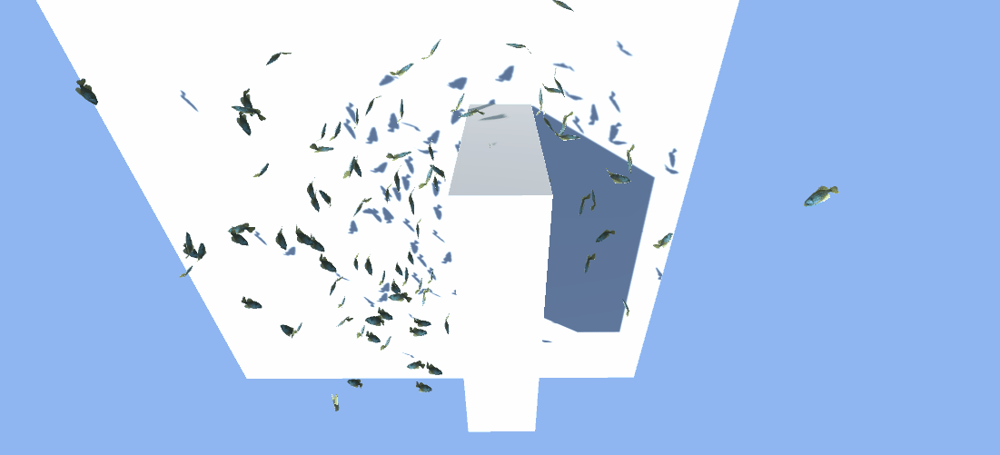

# [Unity](https://unity.com/) Prototype

## Project Description:

Implemented [flocking](https://en.wikipedia.org/wiki/Flocking_(behavior)) with a school of fish.

Simple rules are used, no search algorithms or external packages.

Only Unity.Physics.Rays are used to detect obstacles.

## Screenshots

Obsticle avoidance

